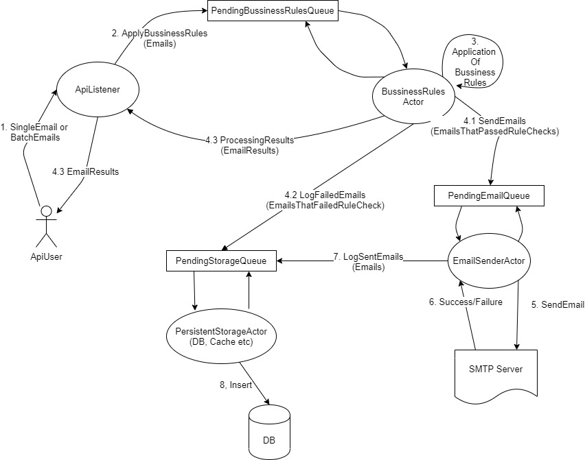

# PostMark.WebAPI

This Repo holds the code for the PostMark Interview. It's composed of a .net core Web API and Actors based on Akka.net. Subprojects have been created in order to create a cleaner design and make it easier for newcomers to understand the design and to reduce their time to first meaningful contributions

## Installation

Use git to download this repo and begin contributing

```bash
git clone 
https://WellCareAppRetro@dev.azure.com/WellCareAppRetro/WellCareAppMiddleware/_git/WellCareAppMiddleware
```

Architecture 




## Demo
Coming soon

### Development
Want to contribute? Great!

To fix a bug or enhance an existing module, follow these steps:

- clone the repo
- Create a new branch (`git checkout -b improve-feature`)
- Make the appropriate changes in the files
- Add changes to reflect the changes made
- Add unit tests to test the changes made
- Add integration tests to test the feature/behavior
- Commit your changes (`git commit -am 'Improve feature'`)
- Push to the branch (`git push origin improve-feature`)
- Create a Pull Request 


## Notes on the Code organization.

The Backend Code relies heavily on Akka.net Actors. Akka is an opinionated framework that forces the developer to put any behavior or action-oriented code behind actors and the only way to invoke said actions is through the use of lightweight CQRs classes. 

Advantages of Akka.Net
It simplifies code organization and makes it easier to standardize and maintain code.
Mentally its much easier to reason about code flows using actors than general mvc frameworks
The biggest advantage Akka has is it enables the developer to scale out individual
parts of the same program. for example you can scale out the bussinesslogic classes
alone and leave the db handler alone without spliting up your code.Its just a configuration in Akka
Also akka allows you to make move your actors to other containers,vms,computers etc
and akka will work without any code changes

Simply put
- Actors go in core.Actors
- Entities go in core.Entities 
- etc

A note on tests...there are 2 kinds of test projects in the repo. 

- Unit tests deal with testing the logic rules of a single actor. that means any dependencies of that actor are mocked out. 
- Integration tests test the behavior of an actor given actual real-world dependencies.

Don't mix the 2 up by putting unit tests in the integration tests project or vice versa

## Adding Bussiness Rules
To add bussiness rules, all thats needed is to implement the IEmailBussinessRule Interface
and put the logic in the RunRuleCheck Method. Remember to cater for both types of requests that 
can be sent. Also...remember that the SingleEmailRequest expects a SingleEmailResult while the 
BulkEmailRequest expects the BulkEmailResult.
e.g

```
public EmailResult RunRuleChecks(ref EmailRequest obj)
{
    EmailResult ruleEvaluationResult = null;

    switch (obj)
    {
        case SingleEmail singleEmail:
            ruleEvaluationResult = RunRuleOnSingleEmail(singleEmail);
            break;

        case BulkEmail bulkEmail:
            ruleEvaluationResult = RunRuleOnBulkEmail(bulkEmail);
            break;

    }

    return ruleEvaluationResult;
}

```
Once you have implemented the Interface, make sure your Rule is added on App Startup. To do that
add it to the SetupBussinessLogicActor in the StartUp.cs file in the Postmark.WebAPI project

##Scaling Out
Akka allows for scaling out of individual parts of your program at runtime by configuration.
With Akka.net you can easily do something like this

```
var actor = actorSystem.ActorOf
(
    BussinessLogicActor.Create
    (
      emailSendingActor: emailSenderActor,
      failedEmailsActor: persistentStorageActor,
      rulesEvaluator
    ).WithRouter(new RoundRobinPool(100),
    nameof(BussinessLogicActor)
);

```

Beyond that, the project is written to be easily deployed on AWS Lambda which supports infinte
scalability

## Contributing
Pull requests are welcome. For major changes, please open an issue first to discuss what you would like to change.

Please make sure to update the tests as appropriate.

## License
[MIT](https://choosealicense.com/licenses/mit/)